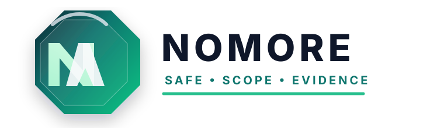

# NOMORE

<p align="center">
  
</p>

NOMORE is a safety-first, modular CLI framework for authorized web security assessment and OSINT research.

## Goals

- Enforce explicit scope and authorization before active testing
- Combine passive reconnaissance, subdomain discovery, crawling, technology detection, and reporting
- Keep evidence, confidence, and risk classification transparent
- Provide a plugin-first architecture for extensibility
- Support local history, reports, and CI-friendly output

## Quick start

```bash
python -m nomore --help
python -m nomore scan example.com --profile standard
python -m nomore scope add "*.example.com"
python -m nomore report --format markdown --output report.md
```

## Suggested command set

- `nomore scan <target>`
- `nomore recon <target>`
- `nomore subdomains <target>`
- `nomore dorks <target>`
- `nomore scope add <pattern>`
- `nomore report --format json`
- `nomore plugin list`
- `nomore doctor`

## Safety model

This project is intentionally built around responsible use:

- passive reconnaissance by default
- explicit scope checks before active testing
- no destructive actions unless explicitly enabled for authorized targets
- no credential stuffing or brute forcing by default
- all results are documented with evidence and confidence levels

## Project layout

```text
nomore/
  cli.py
  config.py
  database.py
  models.py
  plugins.py
  reporting.py
  scope.py
  __main__.py
  __init__.py
```
##Contribute
**Feel free to contribute on this Project**
## License

This project is distributed under the MIT license as provided in the repository.
